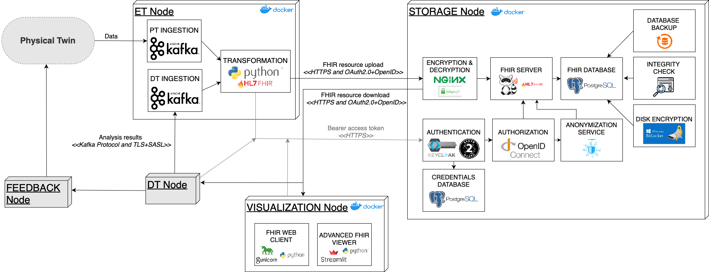

# Secure Digital Twins – A Framework for Secure Data Governance in Healthcare

**Secure Digital Twins** is an innovative platform that implements the Digital Twin concept with a strong focus on secure data governance in the healthcare domain. This repository contains the code that implements the architectural framework described in our research work. The framework addresses key challenges in digital twin engineering—from ensuring interoperability and data standardization to providing robust security throughout the entire data lifecycle.

---

## Overview

Digital Twins (DTs) are virtual replicas of physical systems that enable real-time monitoring, simulation, and decision support. In healthcare, DTs promise enhanced patient care, risk assessment, and personalized treatment. However, the inherent complexity and distributed nature of DT ecosystems introduce significant challenges in data security and interoperability. This project proposes a secure data governance framework that:

- **Ensures data protection** during transmission, storage, and use.
- **Supports interoperability** through compliance with healthcare data standards such as FHIR/HL7.
- **Enables real-time data processing** with a robust ET pipeline.
- **Implements layered security measures** including encryption, access control, authentication, and anonymization.

---

## Key Requirements

Based on our conceptual study, the following key requirements have been addressed:

- **Real-Time Processing (R1):** Continuous ingestion and processing of sensor and medical data.
- **Seamless Interaction (R2 & R3):** Bi-directional communication between the Physical Twin (PT) and Digital Twin (DT) components.
- **Interoperability and Standardization (R4):** Transformation of raw data into standardized formats (FHIR/HL7) to ensure seamless data exchange.
- **Data Security and Privacy (R5, R6 & R7):** Implementation of robust access control (attribute-based), data encryption (in transit and at rest), and anonymization mechanisms compliant with GDPR/HIPAA.
- **Regulatory Compliance (R8):** Adherence to healthcare data protection regulations ensuring secure management of sensitive patient data.

---

## Architecture

The framework is conceptually divided into two main phases:

### 1. Data Pipeline for Digital Twins

The first phase focuses on integrating digital twins into a secure data pipeline that supports:
- **Data Ingestion:** Capturing data from physical sensors, devices, or medical reports via a distributed messaging system (e.g., Apache Kafka).
- **Data Transformation:** Cleaning, standardizing, and converting raw data into FHIR/HL7 compliant formats using a dedicated transformation service, ensuring that the ingested data conforms to recognized healthcare standards.
- **Data Storage:** Securely storing the standardized data in a FHIR-compliant database. This involves both low-level storage (e.g., PostgreSQL with disk encryption and backup systems) and exposing the data via a FHIR server with RESTful APIs.
- **Digital Twin & Feedback:** Once data is stored, it becomes accessible to the Digital Twin component. This component continuously updates its internal model and applies analytical processes (e.g., simulation, prediction, and decision support). A dedicated feedback mechanism then delivers actionable insights or control commands back to the Physical Twin, ensuring a closed-loop system for real-time monitoring and intervention.

### 2. Security Enhancements

The second phase builds on the base data pipeline by introducing dedicated security components:
- **Access Control:** An attribute-based access control system (using XACML concepts) to enforce fine-grained security policies.
- **Encryption & Decryption:** Reverse proxies and disk-level encryption to protect data in transit and at rest.
- **Authentication & Authorization:** Use of identity management (e.g., Keycloak) to manage OAuth2.0-based authentication and secure session management.
- **Anonymization:** Implementation of k-Anonymity to protect patient privacy during data sharing.
- **Resilience Measures:** Backup and integrity check components to protect against data breaches, ransomware, and other cyber threats.
For a detailed explanation of the architecture and security measures, please refer to the accompanying research paper provided in the repository.

---

## Code Structure

The repository is organized into several directories and files that reflect the modular architecture of the framework:
- **analysis node**  
  Contains modules and scripts for data analysis related to digital twin operations. This includes algorithms and utilities to interpret the processed data.

- **ET node**  
  Houses the ET (Extract, Transform) components, including the data ingestion scripts, transformation services (such as the custom FHIR Standardizer), and associated utilities for data cleaning and standardization.

- **storage node**  
  Manages components responsible for secure data persistence. This includes the FHIR server implementation (using HAPI FHIR JPA Server), database configuration files, and scripts to enforce encryption and backup processes.

- **visualization**  
  Contains tools and dashboards for data visualization. This includes web interfaces and interactive applications built with frameworks like Streamlit and Gunicorn to present the processed data and analytics results.

This structure not only reflects the logical separation of concerns but also makes it easier to develop, test, and deploy individual components independently. 

---

## Implementation Details

The repository implements the above framework using a microservices architecture and containerization for modularity and scalability. Key technologies include:
- **Java & Python:** Core languages for implementing the FHIR server, transformation service, and other microservices.
- **Docker:** Containerization of services (e.g., ET components, security proxies) to ensure isolated, reproducible environments.
- **Apache Kafka:** Used for real-time data ingestion and inter-service communication.
- **HAPI FHIR JPA Server & PostgreSQL:** Managing and storing healthcare data in FHIR/HL7 format.
- **Nginx & Keycloak:** Acting as a reverse proxy for secure communication and managing authentication and authorization.
- **Additional Tools:** Disk encryption, backup utilities, and anonymization services further harden the framework against common cyber threats.

---

## Evaluation and Case Study

The framework has been evaluated in a case study for a **Digital Twin of a Mechanical Ventilator** used in pneumonia treatment. In this scenario:
- **Synthetic data** from a simulated patient (using tools like the Pulse Physiology Suite) is ingested.
- Data is transformed into FHIR/HL7 format and securely stored.
- The DT processes the data and provides feedback for treatment adjustments, which are visualized via a web interface.
- The entire data pipeline demonstrates secure and compliant data flow from the physical sensor to the digital simulation.
This case study validates the framework against the initial research questions on data standardization, interoperability, and comprehensive data security.
